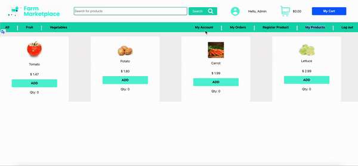
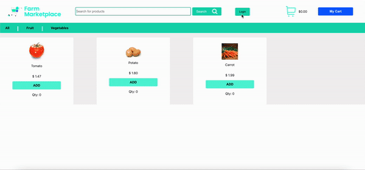
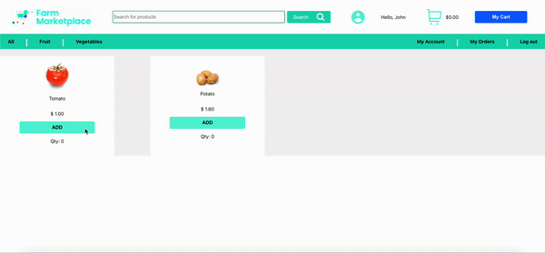
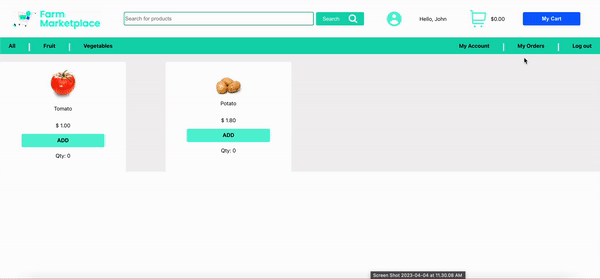
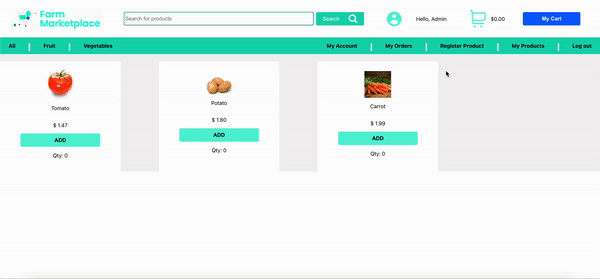
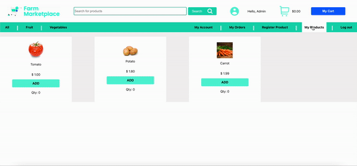
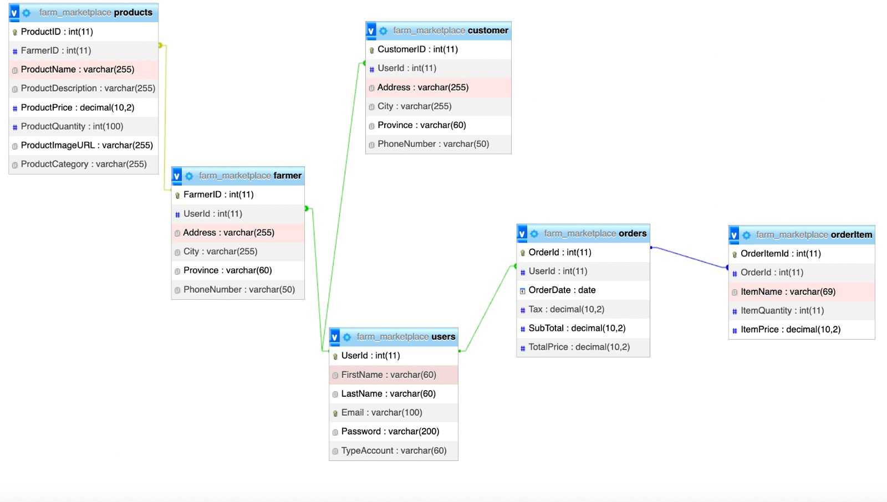

  

# Farm Marketplace

Farm Marketplace is a project developed for the Web Technologies class of the Mobile Solution Development course at Conestoga College.

## Purpose

The agricultural market website aims to promote the connection between local farmers producing high-quality products and consumers passionate about having fresh and healthy products on their tables daily.

By accessing the marketplace, Framer can register all its products simply and quickly to make them available to several customers in seconds. Ja Costumer will visualize several products from different Farmers in his Feed, thus having a great variety of fresh products available.

The marketplace is focused on promoting the development of local Farmers, allowing their products to be delivered more effectively to their customers. In addition, it will enable consumers to have access to healthier products with better cost benefits.

## Deployment

### Running In Terminal

### Cloning the git repository:

- Clone code - "git clone url_repository" .

### Installing node_modules package:
- Running "npm install" in front-end path .

### Creating the image and container in docker:

- Running "docker build -t webproject ." in farm_marketplace path .
- Running "docker run --name webproject-image -p 5000:80 -d webproject" in farm_marketplace path .

### Accessing the website:

- Open http://localhost:5000/www to view it in your browser.
- User default:
  - email: admin@email.com
  - password: 123

## Features

- Farmer and Customer:

  - Create user types `farmer` or `customer`:

    
    
    
   - Update account:
   
          
    
   - Login:
   
      
    
   - Carry out order:
   
     
     
  - Check orders:
  
    
   
- Farmer:

  - Register product:
  
    

  - Upadate and Delete product:
  
    
    
## Technologies Used

 - **Front-end:**
    - `React` JS was used for front-end development, providing a fast and efficient user interface.
 - **Back-end:**
    - `PHP` was used for the back-end development, providing a scalable and reliable server-side scripting language.
 - **Database:**
    - `MySQL` was used for the database, providing a robust and secure data storage solution.
    
 - The technologies were selected based on their suitability for the project requirements, their compatibility with each other, and their ability to provide a high-performance, secure, and user-friendly website.

## Design and Development Process

 - The design and development process followed an Agile methodology, with a focus on frequent iterations and collaboration between the development team.
 - The process involved requirement gathering, design, development, testing, and deployment, with each stage being closely monitored and evaluated to ensure the project was progressing according to schedule.
 - The process involved several challenges, including learning the technology used in the development and creating the user journey and business rule.

## Future work

- **Land Purchase:** The land purchase feature is a unique addition to the Farm Market website, allowing consumers to purchase a piece of land in the farmer's backyard and use it to grow their favorite fruits and vegetables. The land purchase feature has been implemented using a secure payment gateway to ensure all transactions are safe and secure. This feature benefits both consumers and farmers as it allows consumers to take a more hands-on approach to growing their own produce and provides farmers with an additional revenue stream.

- **Farmer Forum:** A forum is a fantastic resource that will connect different Farmers with the aim of sharing tips, problems, area news and other things, thus strengthening the Farmer community. By clicking on the site, the Farmer can send messages and access past posts made by other Farmers.

## Database schema

